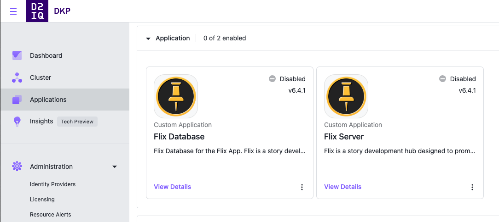

## This is a custom catalog for the Flix Application for Kommander

To add this catalog to a Kommander Essentials cluster run the following:

```
kubectl apply -f - <<EOF
apiVersion: source.toolkit.fluxcd.io/v1beta1
kind: GitRepository
metadata:
  name: flix-catalog-repo
  namespace: kommander
  labels:
    kommander.d2iq.io/gitapps-gitrepository-type: catalog
    kommander.d2iq.io/gitrepository-type: catalog
spec:
  interval: 1m0s
  ref:
    branch: master
  timeout: 20s
  url: https://github.com/phenderson-d2iq/flix-catalog
EOF
```

To add this catalog to a Kommander Enterprise cluster, you will first need to make the project namespace in the Kommander UI. Once you have the project created run the following but replace `flixdemo` with your project namespace:

```
export PROJECT=flixdemo

kubectl apply -f - <<EOF
apiVersion: source.toolkit.fluxcd.io/v1beta1
kind: GitRepository
metadata:
  name: flix-catalog-repo
  namespace: ${PROJECT}
  labels:
    kommander.d2iq.io/gitapps-gitrepository-type: catalog
    kommander.d2iq.io/gitrepository-type: catalog
spec:
  interval: 1m0s
  ref:
    branch: master
  timeout: 20s
  url: https://github.com/phenderson-d2iq/flix-catalog
EOF

``` 

Here is a screenshot of Flix Applications in the Kommander Dashboard:



